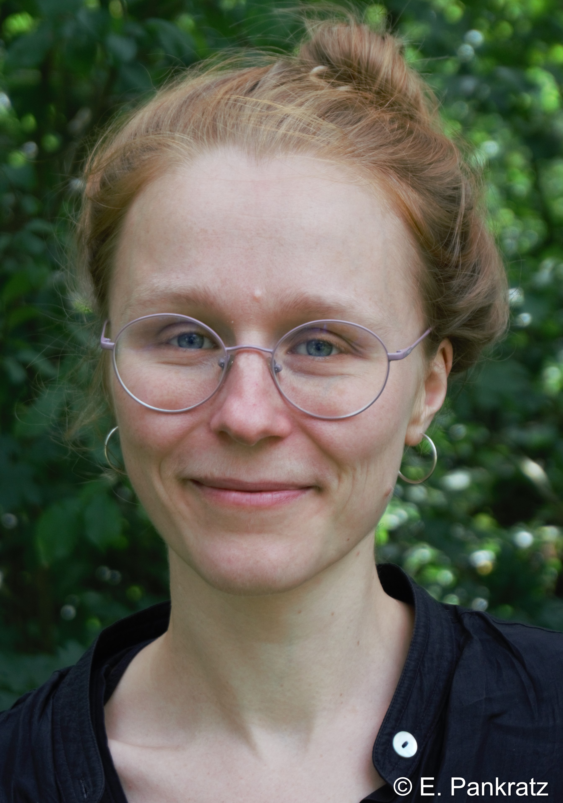

  
 

  

Hi! My name is Lena Schnee. I am a phd student in linguistics at the Heinrich-Heine University in Düsseldorf, Germany. Together with my supervisor, [Stefan Hartmann](https://stefanhartmanneu.wordpress.com/), I work on the DFG-funded project on [german future constructions](https://blogs.phil.hhu.de/futurkonstruktionen/).

 

I am interested in phenomena of language change and the various factors influencing them. 
Besides that, I am also concerned with

- corpus linguistics, 
- computational methods and 
- statistical methods suitable for approaching linguistic questions, 
- ensurance of long-term accessibility of data and resources,
- adequate representation of data and results, 
- science communication inside and out of the field.

 

My first language is German, I also speak English and Swedish. I am rather confident that we could even have a proper conversation in French.
 

My pronouns are (she|sie|hon|elle). 